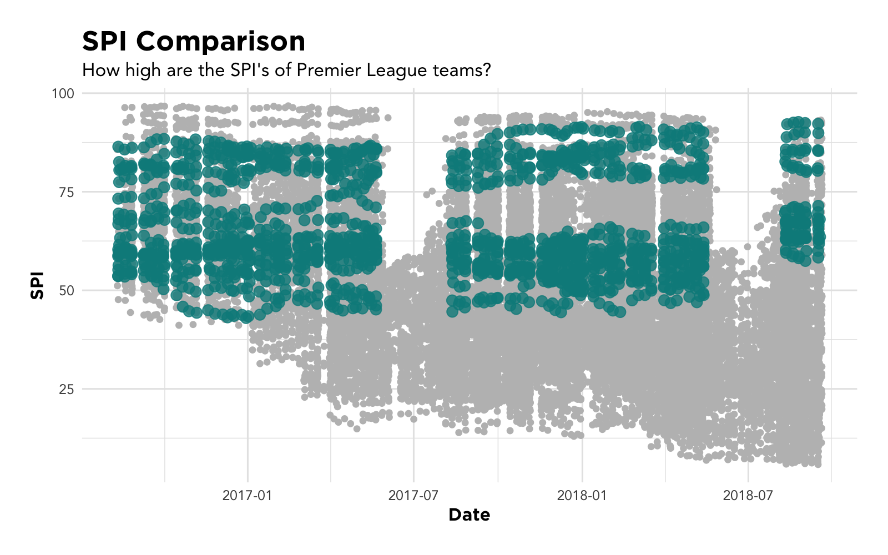

# Is the Premier League the most competitive league in the world? 
### Below are the packages and csv files I'll be using to analyze how great the english teams are compared to the rest of the world


```r
library(tidyverse)
library(ggrepel)
library(devtools)
source("~/Desktop/token.R")
library(expappr)
```


```r
spi_matches <- read.csv("~/Downloads/soccer-spi 2/spi_matches.csv")
spi_global_rankings <-  read.csv("~/Downloads/soccer-spi 2/spi_global_rankings.csv")
spi_global_rankings_int <- read.csv("~/Downloads/soccer-spi 2/spi_global_rankings_intl.csv")
```

## Raw Data

Let's take a look at the data that I have from FiveThirtyEight and see what I'll need to do to clean it up.


```r
spi_matches_2 <- spi_matches %>% 
  mutate(match_id = row_number())

spi_matches_2 %>% 
  head() %>% 
  knitr::kable()
```


|date       | league_id|league                  |team1         |team2               |  spi1|  spi2|  prob1|  prob2| probtie| proj_score1| proj_score2| importance1| importance2| score1| score2|  xg1|  xg2| nsxg1| nsxg2| adj_score1| adj_score2| match_id|
|:----------|---------:|:-----------------------|:-------------|:-------------------|-----:|-----:|------:|------:|-------:|-----------:|-----------:|-----------:|-----------:|------:|------:|----:|----:|-----:|-----:|----------:|----------:|--------:|
|2016-08-12 |      1843|French Ligue 1          |Bastia        |Paris Saint-Germain | 51.16| 85.68| 0.0463| 0.8380|  0.1157|        0.91|        2.36|        32.4|        67.7|      0|      1| 0.97| 0.63|  0.43|  0.45|       0.00|       1.05|        1|
|2016-08-12 |      1843|French Ligue 1          |AS Monaco     |Guingamp            | 68.85| 56.48| 0.5714| 0.1669|  0.2617|        1.82|        0.86|        53.7|        22.9|      2|      2| 2.45| 0.77|  1.75|  0.42|       2.10|       2.10|        2|
|2016-08-13 |      2411|Barclays Premier League |Hull City     |Leicester City      | 53.57| 66.81| 0.3459| 0.3621|  0.2921|        1.16|        1.24|        38.1|        22.2|      2|      1| 0.85| 2.77|  0.17|  1.25|       2.10|       1.05|        3|
|2016-08-13 |      2411|Barclays Premier League |Burnley       |Swansea City        | 58.98| 59.74| 0.4482| 0.2663|  0.2854|        1.37|        1.05|        36.5|        29.1|      0|      1| 1.24| 1.84|  1.71|  1.56|       0.00|       1.05|        4|
|2016-08-13 |      2411|Barclays Premier League |Middlesbrough |Stoke City          | 56.32| 60.35| 0.4380| 0.2692|  0.2927|        1.30|        1.01|        33.9|        32.5|      1|      1| 1.40| 0.55|  1.13|  1.06|       1.05|       1.05|        5|
|2016-08-13 |      2411|Barclays Premier League |Southampton   |Watford             | 69.49| 59.33| 0.5759| 0.1874|  0.2367|        1.91|        1.05|        34.1|        30.7|      1|      1| 1.05| 0.22|  1.52|  0.41|       1.05|       1.05|        6|

Okay.. this is valuable data. However, in order to use it for what I want, there needs to be some cleaning up. 
The main goal here is to create a Home and Away table separately. Once that's done, I'll be able to combine them and
do more manipulation and create better visualization.


```r
spi_matches_2 <- spi_matches %>% 
  mutate(match_id = row_number())

spi_matches_3 <- spi_matches_2[, c(1, 2, 3, 23, 4:22)]


home_teams <- spi_matches_3 %>% 
  select(-contains("2")) %>% 
  mutate(home = 1)

names(home_teams) <- names(home_teams) %>%  str_remove("[0-9]")


away_teams <- spi_matches_3 %>% 
  select(-contains("1")) %>% 
  mutate(home = 0)

names(away_teams) <- names(away_teams) %>% str_remove("[0-9]")

away_teams_for_join <- away_teams %>% 
  rename(opp = team
         ,opp_spi = spi
         ,opp_prob = prob
         ,opp_probtie = probtie
         ,opp_proj_score = proj_score
         ,opp_importance = importance
         ,opp_score = score
         ,opp_xg = xg
         ,opp_nsxg = nsxg
         ,opp_adj_score = adj_score
         ,opp_home = home)

home_teams_updated <- home_teams %>% 
  inner_join(away_teams_for_join, by = "match_id") %>% 
  select(- date.y, - league_id.y, - league.y) %>% 
  rename(date = date.x,
         league = league.x,
         league_id = league_id.x) %>% 
  select(match_id, league_id, league, date, team, home, opp, opp_home, spi, opp_spi, prob, opp_prob, probtie, 
         score, opp_score, proj_score, opp_proj_score, importance, opp_importance, xg, opp_xg, nsxg, opp_nsxg, adj_score, opp_adj_score) %>% 
  arrange(match_id)

home_teams_for_join <- home_teams %>% 
  rename(opp = team
         ,opp_spi = spi
         ,opp_prob = prob
         ,opp_probtie = probtie
         ,opp_proj_score = proj_score
         ,opp_importance = importance
         ,opp_score = score
         ,opp_xg = xg
         ,opp_nsxg = nsxg
         ,opp_adj_score = adj_score
         ,opp_home = home)

away_teams_updated <- away_teams %>% 
  inner_join(home_teams_for_join, by = "match_id") %>% 
  select(- date.y, - league_id.y, - league.y) %>% 
  rename(date = date.x,
         league = league.x,
         league_id = league_id.x) %>% 
  select(match_id, league_id, league, date, team, home, opp, opp_home, spi, opp_spi, prob, opp_prob, probtie, 
         score, opp_score, proj_score, opp_proj_score, importance, opp_importance, xg, opp_xg, nsxg, opp_nsxg, adj_score, opp_adj_score) %>% 
  arrange(match_id)

results_combined <- rbind(home_teams_updated, away_teams_updated) %>% arrange(match_id)

results_combined_2 <- results_combined %>% 
  mutate(result = case_when(score > opp_score ~ "win",
                            score == opp_score ~ "tie",
                            score < opp_score ~ "loss",
                            TRUE ~ "other")) %>% 
  mutate(points = case_when(result == "win" ~ 3,
                            result == "loss"~ 0,
                            result == "tie" ~ 1,
                            TRUE ~ 0)) %>% 
  mutate(goal_differential = score - opp_score)


results_combined_3 <- results_combined_2 %>% 
  mutate(date_actual = as.Date(date)) %>% 
  select(- date)
#filter(date > "2016-08-01" & date < "2017-06-01") %>% 
#filter(between(date, as.Date("2016-08-01"), as.Date("2017-06-01"))) %>% 

results_combined_3 <- results_combined_3[, c(1, 2, 3, 28, 4:27)]


results_combined_4 <-  results_combined_3 %>% 
  mutate(season = case_when(between(date_actual, as.Date("2016-06-01"), as.Date("2017-05-31")) ~ "2016-17",
                            between(date_actual, as.Date("2015-06-01"), as.Date("2016-05-31")) ~ "2015-16",
                            between(date_actual, as.Date("2017-06-01"), as.Date("2018-05-31")) ~ "2017-18",
                            between(date_actual, as.Date("2018-06-01"), as.Date("2019-06-09")) ~ "2018-19",
                            TRUE ~ "other"))

results_combined_5 <- results_combined_4[, c(1,2,3,29,4:28)]
```

## Tidy Data

Alright. Let's see how this looks after the clean up.


```r
results_combined_5 %>% 
  head() %>% 
  knitr::kable()
```


| match_id| league_id|league                  |season  |date_actual |team                | home|opp                 | opp_home|   spi| opp_spi|   prob| opp_prob| probtie| score| opp_score| proj_score| opp_proj_score| importance| opp_importance|   xg| opp_xg| nsxg| opp_nsxg| adj_score| opp_adj_score|result | points| goal_differential|
|--------:|---------:|:-----------------------|:-------|:-----------|:-------------------|----:|:-------------------|--------:|-----:|-------:|------:|--------:|-------:|-----:|---------:|----------:|--------------:|----------:|--------------:|----:|------:|----:|--------:|---------:|-------------:|:------|------:|-----------------:|
|        1|      1843|French Ligue 1          |2016-17 |2016-08-12  |Bastia              |    1|Paris Saint-Germain |        0| 51.16|   85.68| 0.0463|   0.8380|  0.1157|     0|         1|       0.91|           2.36|       32.4|           67.7| 0.97|   0.63| 0.43|     0.45|      0.00|          1.05|loss   |      0|                -1|
|        1|      1843|French Ligue 1          |2016-17 |2016-08-12  |Paris Saint-Germain |    0|Bastia              |        1| 85.68|   51.16| 0.8380|   0.0463|  0.1157|     1|         0|       2.36|           0.91|       67.7|           32.4| 0.63|   0.97| 0.45|     0.43|      1.05|          0.00|win    |      3|                 1|
|        2|      1843|French Ligue 1          |2016-17 |2016-08-12  |AS Monaco           |    1|Guingamp            |        0| 68.85|   56.48| 0.5714|   0.1669|  0.2617|     2|         2|       1.82|           0.86|       53.7|           22.9| 2.45|   0.77| 1.75|     0.42|      2.10|          2.10|tie    |      1|                 0|
|        2|      1843|French Ligue 1          |2016-17 |2016-08-12  |Guingamp            |    0|AS Monaco           |        1| 56.48|   68.85| 0.1669|   0.5714|  0.2617|     2|         2|       0.86|           1.82|       22.9|           53.7| 0.77|   2.45| 0.42|     1.75|      2.10|          2.10|tie    |      1|                 0|
|        3|      2411|Barclays Premier League |2016-17 |2016-08-13  |Hull City           |    1|Leicester City      |        0| 53.57|   66.81| 0.3459|   0.3621|  0.2921|     2|         1|       1.16|           1.24|       38.1|           22.2| 0.85|   2.77| 0.17|     1.25|      2.10|          1.05|win    |      3|                 1|
|        3|      2411|Barclays Premier League |2016-17 |2016-08-13  |Leicester City      |    0|Hull City           |        1| 66.81|   53.57| 0.3621|   0.3459|  0.2921|     1|         2|       1.24|           1.16|       22.2|           38.1| 2.77|   0.85| 1.25|     0.17|      1.05|          2.10|loss   |      0|                -1|

Perfect! This looks a lot better now that I've been able to have records for all home and away teams. 
Now I can actually calculate points recorded, goal differential, and see how each team has performed the past
couple years.
More importantly, I will be able to analyze how the premier league teams are compared to the rest of the world. 
Before I get to that, let's see if I am able to create the league standings through this data.


```r
bpl_standings <- results_combined_5 %>%
  filter(league == "Barclays Premier League") %>% 
  mutate(goal_differential = ifelse(is.na(goal_differential), 0, goal_differential)) %>% 
  #filter(season == "2016-17") %>% 
  group_by(season, team) %>% 
  summarise(total_points = sum(points),
            total_goal_differential = sum(goal_differential)) %>% 
  arrange(season, desc(total_points)) %>%
  group_by(season) %>% 
  mutate(rank = row_number()) %>% 
  select(season, rank, team, total_points, total_goal_differential)

bpl_standings %>%  
  head(n = 20) %>% 
  knitr::kable()
```


|season  | rank|team                 | total_points| total_goal_differential|
|:-------|----:|:--------------------|------------:|-----------------------:|
|2016-17 |    1|Chelsea              |           93|                      52|
|2016-17 |    2|Tottenham Hotspur    |           86|                      60|
|2016-17 |    3|Manchester City      |           78|                      41|
|2016-17 |    4|Liverpool            |           76|                      36|
|2016-17 |    5|Arsenal              |           75|                      33|
|2016-17 |    6|Manchester United    |           69|                      25|
|2016-17 |    7|Everton              |           61|                      18|
|2016-17 |    8|AFC Bournemouth      |           46|                     -12|
|2016-17 |    9|Southampton          |           46|                      -7|
|2016-17 |   10|West Bromwich Albion |           45|                      -8|
|2016-17 |   11|West Ham United      |           45|                     -17|
|2016-17 |   12|Leicester City       |           44|                     -15|
|2016-17 |   13|Stoke City           |           44|                     -15|
|2016-17 |   14|Crystal Palace       |           41|                     -13|
|2016-17 |   15|Swansea City         |           41|                     -25|
|2016-17 |   16|Burnley              |           40|                     -16|
|2016-17 |   17|Watford              |           40|                     -28|
|2016-17 |   18|Hull City            |           34|                     -43|
|2016-17 |   19|Middlesbrough        |           28|                     -26|
|2016-17 |   20|Sunderland           |           24|                     -40|

Nice! It looks like the cleaning up worked and I was able to replicate the same table that I can see online. It hurts
to see **Arsenal** fifth but at least that is the true story and I got the right data :disappointed: 
## Premier League Numbers
Let's take a look at the premier league results over the past couple seasons.

#### Premier League results -


```r
premier_league_results <- results_combined_5 %>% 
  filter(league == "Barclays Premier League")

premier_league_results %>% 
  head %>% 
  knitr::kable()
```


| match_id| league_id|league                  |season  |date_actual |team           | home|opp            | opp_home|   spi| opp_spi|   prob| opp_prob| probtie| score| opp_score| proj_score| opp_proj_score| importance| opp_importance|   xg| opp_xg| nsxg| opp_nsxg| adj_score| opp_adj_score|result | points| goal_differential|
|--------:|---------:|:-----------------------|:-------|:-----------|:--------------|----:|:--------------|--------:|-----:|-------:|------:|--------:|-------:|-----:|---------:|----------:|--------------:|----------:|--------------:|----:|------:|----:|--------:|---------:|-------------:|:------|------:|-----------------:|
|        3|      2411|Barclays Premier League |2016-17 |2016-08-13  |Hull City      |    1|Leicester City |        0| 53.57|   66.81| 0.3459|   0.3621|  0.2921|     2|         1|       1.16|           1.24|       38.1|           22.2| 0.85|   2.77| 0.17|     1.25|      2.10|          1.05|win    |      3|                 1|
|        3|      2411|Barclays Premier League |2016-17 |2016-08-13  |Leicester City |    0|Hull City      |        1| 66.81|   53.57| 0.3621|   0.3459|  0.2921|     1|         2|       1.24|           1.16|       22.2|           38.1| 2.77|   0.85| 1.25|     0.17|      1.05|          2.10|loss   |      0|                -1|
|        4|      2411|Barclays Premier League |2016-17 |2016-08-13  |Burnley        |    1|Swansea City   |        0| 58.98|   59.74| 0.4482|   0.2663|  0.2854|     0|         1|       1.37|           1.05|       36.5|           29.1| 1.24|   1.84| 1.71|     1.56|      0.00|          1.05|loss   |      0|                -1|
|        4|      2411|Barclays Premier League |2016-17 |2016-08-13  |Swansea City   |    0|Burnley        |        1| 59.74|   58.98| 0.2663|   0.4482|  0.2854|     1|         0|       1.05|           1.37|       29.1|           36.5| 1.84|   1.24| 1.56|     1.71|      1.05|          0.00|win    |      3|                 1|
|        5|      2411|Barclays Premier League |2016-17 |2016-08-13  |Middlesbrough  |    1|Stoke City     |        0| 56.32|   60.35| 0.4380|   0.2692|  0.2927|     1|         1|       1.30|           1.01|       33.9|           32.5| 1.40|   0.55| 1.13|     1.06|      1.05|          1.05|tie    |      1|                 0|
|        5|      2411|Barclays Premier League |2016-17 |2016-08-13  |Stoke City     |    0|Middlesbrough  |        1| 60.35|   56.32| 0.2692|   0.4380|  0.2927|     1|         1|       1.01|           1.30|       32.5|           33.9| 0.55|   1.40| 1.06|     1.13|      1.05|          1.05|tie    |      1|                 0|

### Premier League Table - (2016-Present)
It looks like the goal differential is NA for all the teams this season. This is a results of the data I have
including future matches that are scheduled this season. I'll have to do some manipulation here to substitute 
the NA values (future matches) for 0s in order to get the correct goal differential for the current season.


```r
premier_league_table <- premier_league_results %>% 
  mutate(goal_differential = ifelse(is.na(goal_differential), 0, goal_differential)) %>% 
  #filter(season == "2016-17") %>% 
  group_by(season, team) %>% 
  summarise(total_points = sum(points),
            total_goal_differential = sum(goal_differential)) %>% 
  arrange(season, desc(total_points)) %>%
  group_by(season) %>% 
  mutate(rank = row_number()) %>% 
  select(season, rank, team, total_points, total_goal_differential) %>% 
  arrange(desc(season))

premier_league_table %>% 
  head(n = 20) %>% 
  knitr::kable()
```


|season  | rank|team                     | total_points| total_goal_differential|
|:-------|----:|:------------------------|------------:|-----------------------:|
|2018-19 |    1|Liverpool                |           18|                      12|
|2018-19 |    2|Chelsea                  |           16|                      10|
|2018-19 |    3|Manchester City          |           16|                      16|
|2018-19 |    4|Watford                  |           13|                       5|
|2018-19 |    5|Arsenal                  |           12|                       3|
|2018-19 |    6|Tottenham Hotspur        |           12|                       5|
|2018-19 |    7|AFC Bournemouth          |           10|                      -1|
|2018-19 |    8|Manchester United        |           10|                       0|
|2018-19 |    9|Leicester City           |            9|                       1|
|2018-19 |   10|Wolverhampton            |            9|                       0|
|2018-19 |   11|Crystal Palace           |            7|                      -2|
|2018-19 |   12|Everton                  |            6|                      -3|
|2018-19 |   13|Brighton and Hove Albion |            5|                      -3|
|2018-19 |   14|Fulham                   |            5|                      -5|
|2018-19 |   15|Southampton              |            5|                      -3|
|2018-19 |   16|Burnley                  |            4|                      -3|
|2018-19 |   17|West Ham United          |            4|                      -6|
|2018-19 |   18|Cardiff City             |            2|                     -11|
|2018-19 |   19|Huddersfield Town        |            2|                     -11|
|2018-19 |   20|Newcastle                |            2|                      -4|

Perfect! Different table, yet **Arsenal** is still not at the top, which means my data is probably right again.
## Barclays Premier League Comparison - Analysis phase
### SPI of Premier League teams compared to the rest

What's the SPI of Premier League teams looking like every week compared to the rest of the world? 
I'm pretty sure I'm able to create some sort of visual here highlight premier league teams SPI and greying out
all other teams SPI. 


```r
grey_results <- results_combined_5[, -6] %>% filter(date_actual < "2018-09-20")
```

```r
results_combined_5 %>% 
  filter(league == "Barclays Premier League", date_actual < "2018-09-20") %>% 
  ggplot(aes(date_actual, spi, color = league)) + 
  geom_jitter(data = grey_results, colour = "grey") +
  geom_jitter(alpha = .8, size = 3, color = "cyan4") +
  theme_expapp() +
  scale_color_discrete(guide = FALSE) +
  xlab("Date") +
  ylab("SPI")
```




